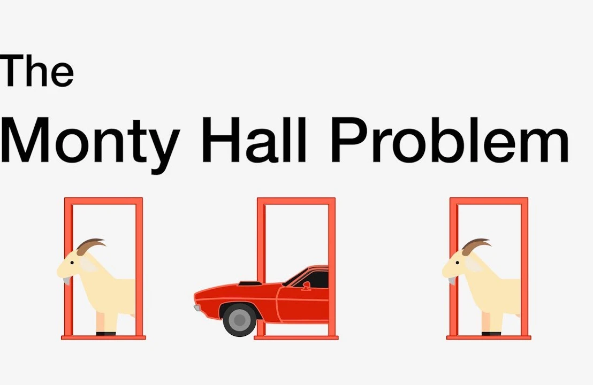
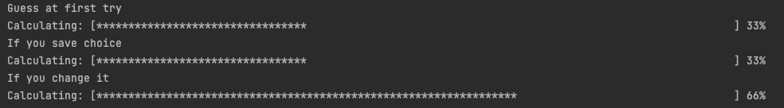

___
# The Monty Hall problem
The Monty Hall problem is a famous probability puzzle based on a game show scenario. There are three doors, behind one of which is a prize (e.g., a car), while the other two hide goats. The contestant picks one door, and then the host, who knows what's behind each door, opens another door, revealing a goat. The contestant is then given a chance to switch their choice to the remaining unopened door. The puzzle challenges our intuition about probability - the best strategy is actually to switch doors, as this gives a 2/3 chance of winning, compared to a 1/3 chance if staying with the original choice.

I have visually implemented this problem in Java. 
Here's how it looks
